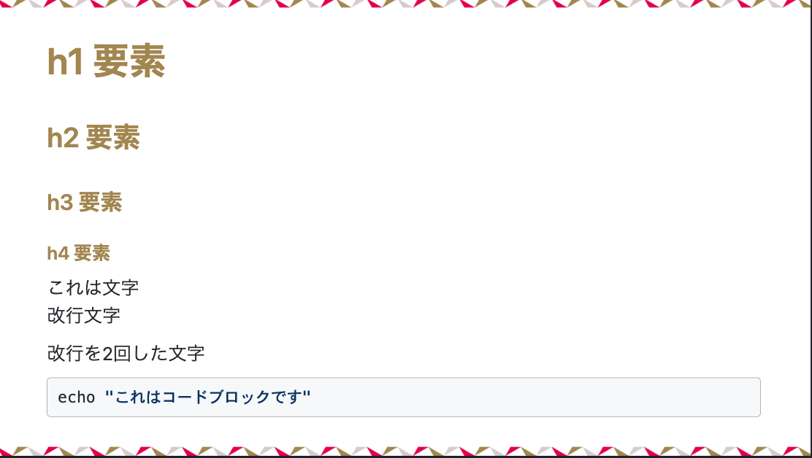
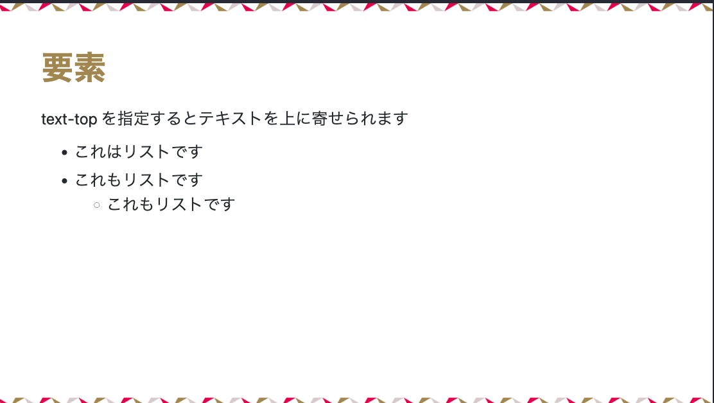

# marp-ictsc-theme

Marp ICTSC Theme is a theme for [Marp](https://marp.app/).

## 使用例

|  |  |
| ------------------ | ------------------ |
|  |  |


## 使い方

1. VS Code の設定で `markdown.Marp.themes` と検索し `https://raw.githubusercontent.com/ictsc/marp-ictsc-theme/main/theme/ictsc.css` を設定
2. [example.md](./example/example.md)を参考にし markdown ファイルを作成する

## 開発方法

### 前提

- SCSS が使える環境が必要です。

### 手順

sass をウォッチする

```
npm install -g sass
```